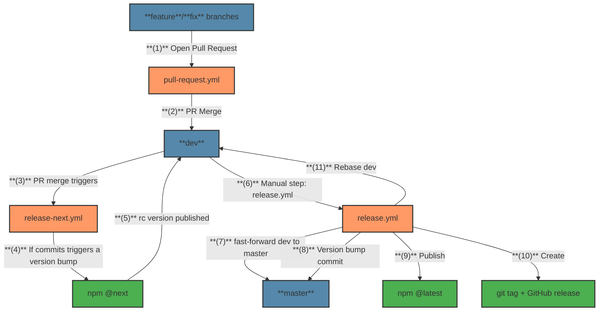

# CI/CD Workflows

This document describes the CI/CD workflows used in this repository.

## Overview

This project uses a Git flow with three main branches:
- **`feature`/`fix` branches**: Used for development of new features or bugfixes
- **`dev` branch**: Integration branch for features/fixes, publishes `@next` npm packages
- **`master` branch**: Production branch, publishes `@latest` npm packages

## High-Level Diagram

## Workflow Details

### 1. Pull Request Workflow (`pull-request.yml`)

**Triggered by:**
- Pull request events (`opened`, `synchronized`, `reopened`, `ready_for_review`)

**Steps:**
- **(1) Open Pull Request**: Developer creates PR from `feature`/`fix` branch to dev
- **(2) PR Merge**: After approval and passing checks, PR is merged to dev

**Actions:**
- Installs dependencies
- Builds TypeScript code
- Runs linting
- Performs type checking
- Executes tests

**Notes:**
- Skipped for draft PRs
- Fails if any check fails, preventing merge

### 2. Release Next Workflow (`release-next.yml`)

**Triggered by:**
- Push to `dev` branch (typically after PR merge)

**Steps:**
- **(3) PR merge triggers**: Merge to dev automatically triggers the workflow
- **(4) If commits triggers a version bump**: Checks if commits triggers aversion bump
- **(5) `rc` version published**: If needed, publishes rc version to npm

**Actions:**
1. Determines if a version bump is needed based on conventional commits
2. If needed:
   - Calculates the next `rc` version (e.g., `1.2.3-rc1`, `1.2.3-rc2`)
   - Run tests and builds the package
   - Publishes to npm with the `@next` tag

**Notes:**
- `rc` version is ephemeral and not committed to the repository, to prevent polluting the git history
- Only publishes if conventional commits indicate a version bump is needed
- Uses semantic versioning based on semantic commit messages

### 3. Release Workflow (`release.yml`)

**Triggered by:**
- Manual workflow dispatch (via GitHub Actions UI)

**Steps:**
- **(6) Manual step: release.yml**: Manually triggered when ready to release
- **(7) fast-forward dev to master**: Updates master branch to match dev
- **(8) Version bump commit**: Increments version based on semantic commit messages
- **(9) Publish**: Publishes package to npm with latest tag
- **(10) Create**: Creates git tag and GitHub release
- **(11) Rebase dev**: Updates dev branch with version bump commit

**Actions:**
1. Validates that a version bump is needed based on conventional commits
2. Fast-forwards `master` branch to match `dev`
3. Bumps version according to semantic conventions
4. Builds and tests the package
5. Publishes to npm with the `latest` tag
6. Creates a git tag and GitHub release
7. Rebases `dev` to `master` to keep them in sync

**Notes:**
- The version bump is committed to the repository
- Fails if no version bump is needed (prevents unnecessary releases)
- Requires manual trigger after validation in development environments

## Version Bumping Logic

This project uses [conventional-recommended-bump](https://github.com/conventional-changelog/conventional-changelog/tree/master/packages/conventional-recommended-bump) to determine the appropriate version bump based on commit messages:

- `feat:` commits trigger a `minor` version bump
- `fix:` commits trigger a `patch` version bump
- `BREAKING CHANGE:` or `breaking:` commits trigger a `major` version bump

Commits with types like `docs:`, `style:`, `test:`, or `ci:` do not trigger version bumps.

Please see [CONTRIBUTING.md](CONTRIBUTING.md) for more semantic commit message details.